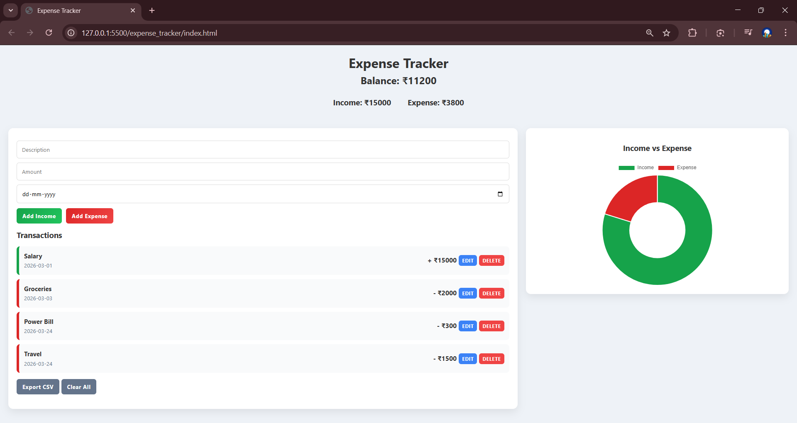

# 💰 Expense Tracker

A clean and responsive web application to track your income and expenses with real-time updates and visual insights.

---

## 🚀 Features
- ➕ Add income and expense transactions
- ✏️ Edit and delete transactions
- 📊 Income vs Expense chart (Chart.js)
- 💾 Data stored using Local Storage
- 📁 Export transactions as CSV
- 📱 Responsive and modern UI

---

## 🛠️ Tech Stack
- HTML
- CSS
- JavaScript
- Chart.js

---

## 📸 Screenshot

---

## 🌐 Live Demo
(Add your GitHub Pages link here after enabling it)

---

## 📌 How to Use
1. Enter description, amount, and date
2. Click "Add Income" or "Add Expense"
3. View balance and chart updates instantly
4. Edit or delete anytime

---

## 💡 Future Improvements
- Dark mode 🌙
- Category-wise tracking
- Monthly reports
